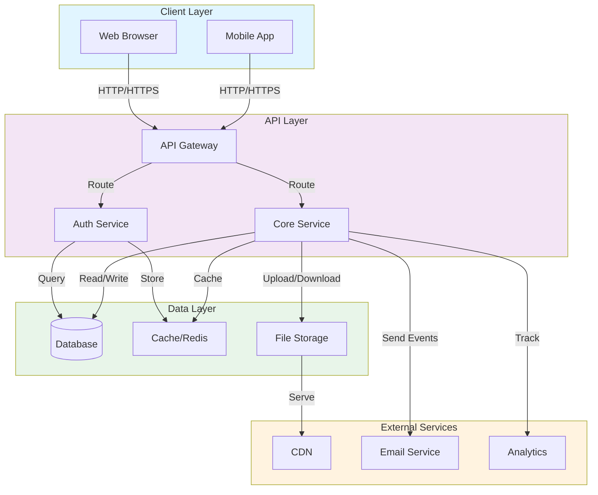

# Architecture Overview

## System Architecture

## Component Descriptions

### Client Layer
- **Web Browser**: Primary interface for desktop users
- **Mobile App**: Native or cross-platform mobile application

### API Layer
- **API Gateway**: Entry point for all client requests, handles routing and rate limiting
- **Auth Service**: Manages authentication, authorization, and token validation
- **Core Service**: Main business logic and feature implementation

### Data Layer
- **Database**: Primary data store (PostgreSQL, MongoDB, etc.)
- **Cache/Redis**: In-memory cache for frequently accessed data
- **File Storage**: Cloud storage for user-generated content and assets

### External Services
- **CDN**: Content Delivery Network for static assets and media
- **Email Service**: Transactional email delivery
- **Analytics**: User behavior and system monitoring

## Data Flow

1. **Request Flow**: Client → API Gateway → Service → Data Layer
2. **Response Flow**: Data Layer → Service → API Gateway → Client
3. **Caching**: Hot data cached in Redis for reduced database load
4. **Static Content**: Served through CDN for improved performance

## Security Considerations

- API Gateway validates all incoming requests
- Auth Service enforces authentication and authorization policies
- Data encrypted in transit (HTTPS) and at rest
- External services communicate securely via API keys and tokens

